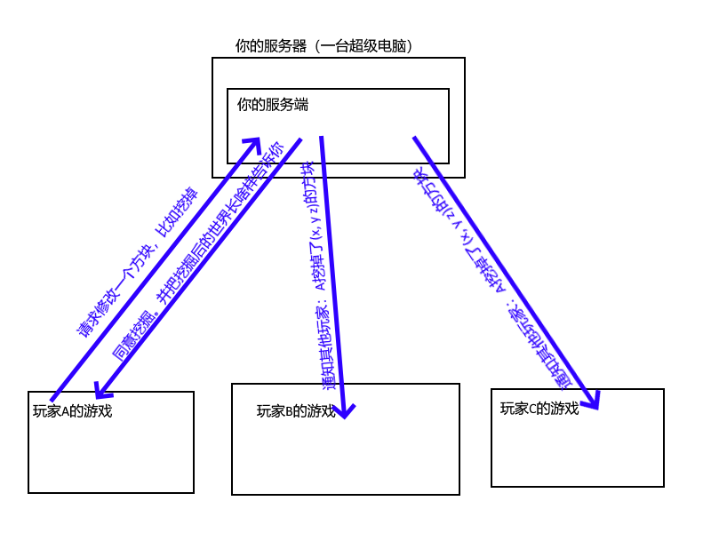

# 1.2.B-服务端？服务器？客户端？

我们来快速看一下这三个东西都是啥！

## 客户端？

很简单，客户端就是你电脑上的游戏。

客户端**负责**给你渲染出游戏，也就是你玩到的内容，这时候你一个人玩足够了，但是怎么和别人一起玩呢？

## 把所有人都叫过来！服务端！

现在的游戏逻辑**只在**你电脑上的游戏里面处理，但是如果很多人要一起玩一个游戏，这种情况应该怎么办呢？

毕竟各自的游戏不相通，怎么让所有人的游戏内容（比如，墨念挖了一个方块），让所有人都知道呢？

这时候，我们把游戏逻辑拿出来，让**服务器**去处理，所有人在操作游戏前，都要先**问问服务器同意不同意**，服务器也同时向所有玩家同步世界的修改，其他人都在哪里等信息

这时候就要一个专门的软件，专门为所有玩家同步游戏和处理玩家信息，我们就称之为**服务端**

这时候，只要所有人都链接**服务器**，就能快乐的一起玩了！

::: details 服务器是什么？

服务器也是一台电脑，只不过这台电脑比较特殊：

 - 他几乎永远不关机
 - 他的配置一般很强
 - 最重要的是，所有人都能连上

:::
## 服务端核心？

如果每一个服务器都要自己写服务端那就太麻烦了....

这时候能不能有一个人写一个**总的服务端**，而其他人给他写插件，这样我可以随时想用哪个插件用哪个，这不是更好吗？

于是就有了**服务端核心**，他只管**保证MC原版的运行**，同时**提供一些接口**，能让插件接入进来**发挥魔法**

1.3.D会详细介绍MC的**服务端核心**

## 说着好复杂，有没有图片啊？

~~我的美术水平很差~~

但是我们可以得到一张长这样的图片：

你可以看到，服务端要做的事情就是：

 - 转发世界的修改和玩家的位置
 - 处理玩家所有操作的请求

## 课后作业

现在玩家B请求在(x, y, z)放置了一个方块，请画出和我的示意图一样的示意图

这个就不放答案了，主要是举一反三

## 课间休息

字数统计：542

Q: 老师老师 你的服务端确实很有意思 那么哪里可以找到这些服务端呢？

A: [1.3.D-这一大堆MC服务端都是啥和啥](./1.3.D-这一大堆MC服务端都是啥和啥)