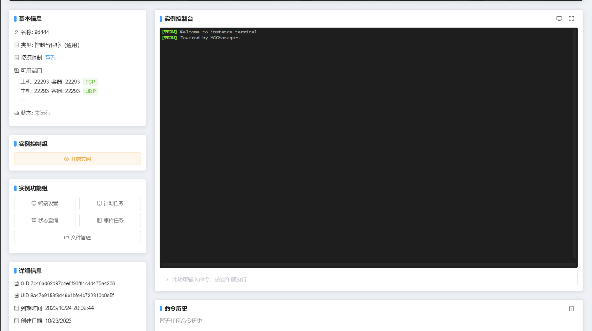

# 1.5.B-都准备好了！我应该买什么服务器？

## 单端服？群组服？这些都是什么？

**单端服**就是你只跑一个**服务器核心**，只做一个玩法的服务器

**群组服**就是由很多个小服务器连起来的**大服务器**，一般群组服会同时有很多玩法，比如同时有生存和空岛

**子服**就是群组服下的每一个提供单独玩法的小服务器

**Mod服**就是以Mod为核心玩法的服务器

## 选购服务器

> [!important] 墨冉的省钱小妙招
>
> 其实你完全可以在自己的电脑上测试服务器，不一定非先要买一台
>
> 在自己的电脑上测试服务器和在服务器上测试服务器完全一致，等你准备好**服务端**，再部署到服务器上吧！
>
> 以下内容只是让你先行了解，等看完服务端调试教程并做出一个完整的服务端后，再买服务器也不迟
>

虽然我不是想那么早讲**如何选购服务器**，但是有一些内容还是要提一下，放最后讲也不好

### 面板？VPS？

你现在去买服务器，应该会看到这三种机器：

| 类型  | 适用范围               | 推荐指数（满分五⭐） |
|-----|--------------------|------------|
| 面板  | 超小型服务器，且**只能开**单端服 | ⭐⭐         |
| VPS | 中小型服务器，可以开群组服/mod服 | ⭐⭐⭐⭐       |
 | 独立机 | 超大型服务器/Mod服        | ⭐⭐⭐⭐⭐      |

价格上：**独立机**最贵>**VPS**稍贵>**面板**最便宜

问题来了，这些机器都是干嘛的

---

#### 面板服【推荐别用】

面板服就是**不让你访问一台服务器的系统，只给你一个操作网页**的服务器

面板服相当于把一个服务器分割出来出租给其他人，你一块我一块，各取所需

它长这样：

**优势**：便宜

**缺点**：一车

1. 部分面板限制服务器核心，你可能用不了想用的核心
2. 面板过于简单....这也是缺点！！使用面板，你可能会对**为什么服务器能跑起来**形成错误的认知
3. 面板可能会拖慢你的服务器

> [!CAUTION] 面板服务商还有可能挂羊头卖狗肉
> 
> 由于你**只能操作这个网页**，你无法知道这个服务器到底是什么配置的
> 
> 这可能会出现**超开**（一个服务器承担了不该承担的服务器数量），导致你并不能达到你想要的性能
> 
> 所以我们还是用VPS吧

但是部分情况用面板是很舒服的，比如就三五个好友一起玩一张地图，这种情况用面板还比较合适

---

#### VPS（Virtual Private Server）

VPS中文名为虚似专用服务器，他把服务器的资源分割出来，相当于隔离成一台台小服务器卖给各位，并且**由于你能看到操作系统，所以VPS分给你的那一块资源由你全程独享**

并且他没有**面板服的那些问题**

#### 独立机

直接租下整台服务器！适合财大气粗的大佬！

但是我们是新手，所以先不考虑这个

## 如何选择配置

大家好啊，我是~~黑心商家~~良心服务商墨冉云服务的销售，墨冉DCCX desu！

今天来卖点服务器

> [!Important] 这只是个例子
> 
> **并不存在墨冉云服务**，这只是为了举例！！！
> 

> [!Note] 参考信息
> 
> 这里很大程度参考了极光Creeper的教程，
> 
> ~~价格表直接抄的~~
> 
> 原帖存档地址：[!这里](https://www.mcbbs.co/thread-255-1-1.html)

我们家的服务器~~保证坑爹~~物美价廉，这是我们的价格表

| 套餐编号 | CPU核心数(个) | 内存大小(G) | 硬盘大小（GB） | 上下行带宽大小（M） | CPU频率（Ghz） | 价格（元/月） |
|------|-----------|---------|----------|------------|------------|---------|
| 套餐1  | 5         | 1G      | 20GB     | 5M         | 2.0Ghz     | 1元/月    |
| 套餐2  | 1         | 10G     | 20GB     | 5M         | 3.0Ghz     | 80元/月   |
| 套餐3  | 4         | 8G      | 20GB     | 10M        | 3.5Ghz     | 170元/月  |
| 套餐4  | 8         | 16G     | 20GB     | 12M        | 4.0Ghz     | 499元/月  |
| 套餐5  | 10        | 20G     | 60GB     | 12M        | 5.0Ghz     | 650元/月  |

首先，在选购配置前，你要**先确定好你的需求**

还记得我们在**1.1.T**写的计划表了吧，现在可以拿出来了：

**服务器类型**决定你服务器的CPU要有多快，要有多少硬盘大小可以保存玩家的地图，已经要有多少带宽来承载玩家

同时，你要为你的计划表新增一个东西

**计划承载的同时在线玩家数量**：20人？50人？注意：这里是**同时在线**

建议新服主先把目标定小一点，慢慢来

:::tip CPU核心？内存大小？这堆到底是什么？

如果我们把一台服务器比作~~墨云大饭店~~**一家饭馆**的话：

**CPU核心数量**就是你的员工数量，有多少人帮你干活，决定玩家卡不卡的因素之一

**CPU频率**就是饭馆的员工各个有多强，频率越高，CPU越强，决定玩家卡不卡的因素之一

**内存大小**就是饭馆的店面大小，决定能容纳多少人的因素之一

**硬盘大小**就是饭馆的仓库大小，决定能存储多少数据

**上下行带宽大小**就是饭馆门的大小，决定有多少人能同时挤进来吃饭

~~为什么要同时进来吃饭~~

:::

确定好你的配置了吗？

接下来，我们要做的是：分析理论情况，对比你的需求，得出买不买的结论

用极光Creeper的原话是：

 > 三步 分析 -> 思考 -> 冷静地得出结论 是所有新人需要学会的 不然就会被坑

评价等级从最差到最好分为：**严重不足<符合要求<超级强悍**

| 套餐编号 | CPU核心数(个) | 内存大小(G) | 硬盘大小（GB）   | 上下行带宽大小（M） | CPU频率（Ghz） | 价格（元/月） |
|------|-------|---------|------------|------------|------------|---------|
| 套餐1  | 5     | 1G      | 20GB       | 5M         | 2.0Ghz     | 1元/月    |
| 各项评价 |  符合要求 | 严重不足 | 符合要求       | 符合要求 | 严重不足       | |

除了他耀眼的价格，还有他逆天的配置

你想做的：开一个10个人同时在线的插件服

实际上的
1. 这个机器绝对血赚，一块钱他爆炸了我都说他炸的响
2. 这东西能带10人纯净服都是谢天谢地了

这个机器的配置离谱之处：
1. CPU核心有五个，但是CPU频率是**逆天的低**，如果用汽车做比喻的话，**跑车装三轮车发动机，让我们一起驰骋沙场**
2. 1GB内存：一车人来你家饭馆吃饭，但是你家饭馆店面大小只够站一个人，~~把所有人都塞进这一点点空间疑似有点违反日内瓦公约了~~

~~饭馆无限制格斗大赛，谁打赢了谁吃饭~~

| 套餐编号 | CPU核心数(个) | 内存大小(G) | 硬盘大小（GB） | 上下行带宽大小（M） | CPU频率（Ghz） | 价格（元/月） |
|------|-----------|---------|----------|------------|------------|---------|
| 套餐2  | 1         | 10G     | 20GB     | 5M         | 3.0Ghz     | 80元/月   |
| 各项评价 | 严重不足      | 符合要求    | 符合要求     | 符合要求 | 符合要求       | |

这也是个逆天配置

这次3.0Ghz的CPU频率够了（说实话，高版本推荐频率再高点），但是**这特么只有一个CPU核心**

回到墨云大饭店的例子，相当于是你找了个暑假工，但是整个饭店就只有他一个人打工，洗碗烧饭当服务员算账丢垃圾都是他，这服务器能快就有鬼

这个配置是一个典型的**某一项不行，导致整个服务器不行**的情况，在选购配置的时候要注意这种陷阱

| 套餐编号 | CPU核心数(个) | 内存大小(G) | 硬盘大小（GB）   | 上下行带宽大小（M） | CPU频率（Ghz） | 价格（元/月） |
|------|-------|---------|------------|------------|------------|---------|
| 套餐3  | 4         | 8G      | 20GB     | 10M        | 3.5Ghz     | 170元/月  |
| 各项评价 |  符合要求 | 符合要求    | 符合要求       | 符合要求 | 符合要求       | |

这个套餐价格合适，非常合理，各项都均衡，一般这时候商家还会和你说上限大约是50人

**很好对吧？**

问题是：**如果50个人全塞进来，服务器会咋样**

会卡爆，在优化完后，应该能容纳20~30人内流畅游玩

但是50人就算了 走一步 卡两步

重点是：**商家宣传的上限，只是服务器爆炸前能塞进来多少人，完全不考虑能不能流畅游玩**

并且**部分插件可能非常吃性能，比如粘液科技**

商家的宣传宣传人数再打个七折八折，可能就是他最流畅的情况

建议购买服务器的时候要留一些冗余，因为**你也不知道你的玩家会造什么机器让你开心开心**

| 套餐编号 | CPU核心数(个) | 内存大小(G) | 硬盘大小（GB）   | 上下行带宽大小（M） | CPU频率（Ghz） | 价格（元/月） |
|------|-------|---------|------------|------------|------------|---------|
| 套餐4  | 8         | 16G     | 20GB     | 12M        | 4.0Ghz     | 499元/月  |
| 各项评价 |  符合要求 | 符合要求    | 符合要求       | 符合要求 | 符合要求       | |

合理，非常合理，只给单端用50人应该较为流畅，上限可能会有100多

| 套餐编号 | CPU核心数(个) | 内存大小(G) | 硬盘大小（GB） | 上下行带宽大小（M） | CPU频率（Ghz） | 价格（元/月） |
|------|-------|---------|----------|------------|------------|---------|
| 套餐5  | 10        | 20G     | 60GB     | 12M        | 5.0Ghz     | 650元/月  |
| 各项评价 |  符合要求 | 符合要求    | 符合要求     | 符合要求 | 超级强悍       | |

老师老师，为什么这里硬盘多了40GB，能存储更多玩家数据了，还是符合要求呢？

**需要多大的硬盘基本取决于你玩家跑图多不多**

MC占存储空间大头的就是地图数据了，如果你限制玩家跑图，可能20GB就多的用不完了

但是如果是60GB，也看玩家跑图多不多。至少你可以不用频繁的删除资源世界了x

**这个CPU是什么情况呢？** 优秀，超级优秀，高性能高主频的代表

相当于你家饭店招工，但是不知道你从哪找来**钢铁侠**帮你干活，还不是一个，看核心数，这teme有10个

现在上5Ghz频率的CPU有谁？R9-9950X 14700K 都是高端中的高端

~~建议谁买一个送给我~~

## 服务器操作系统

服务器也是电脑，也需要一个操作系统，那么我们可以选什么呢？
 1. Windows Server，用起来和你家电脑一模一样，萌新狂喜
 2. Linux，**世界上最好的操作系统**，萌新100%不会用，~~推荐全宇宙都来用这个~~

一般情况下直接装Windows Server即可，用起来和你家电脑一模一样的

如果你家电脑不是Windows而是MacOS（苹果的操作系统）......其实也差不多

如果你没用过电脑.....买一个用用吧）

**如果你家电脑是Linux，请勿在这里炸鱼**

## 课后作业

随便找一家服务商，并尝试分析他的套餐合理不合理，适合谁用

## 课间休息

字数统计：2806字

（呼呼大睡）