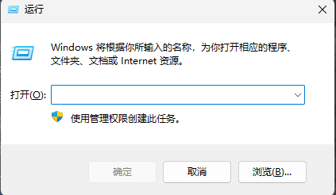
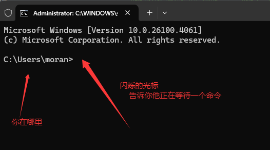
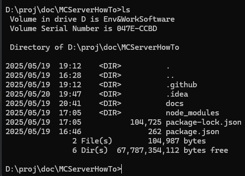
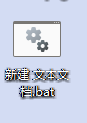
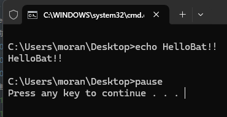

# 1.6.B-都准备好了？还有什么我要知道的吗？

嘛......墨冉相信你已经装好了**趁手的工具**，计划好了你要承载的玩家数量和配置需求。在开始制作一个属于我们自己的服务端前，我们还需要知道什么呢？

## 终端

很久很久以前，~~那是一个春天~~，那时候的电脑还没有图形界面

一般人想用电脑，必须对着一个黑洞洞的窗口，往里面输入一些似懂非懂的命令，这就是终端窗口

后来，电脑有了图形界面，但是**终端程序由于不用渲染界面，能把这部分性能省下来去做其他事**，所以现在的电脑还是保留了终端

::: tip 瞅一眼？

**如果你是Windows电脑**，按下Windows+R组合键（同时按下这两个键），就会弹出来一个被成为「运行」的窗口



在打开里面输入「cmd」，之后按下确定（回车也行）

如果你用的系统是Windows 11，应该会看到和我一样的终端窗口

「>」符号前面是**当前终端所在的位置**，后面有个闪烁的光标，代表正在等待你输入命令



你可以试一下：

dir命令：输出当前目录下的文件和文件夹



**如果你用的是Linux系统......请勿炸鱼！！！**
:::

MC服务器需要安装java后用「Java」命令启动，所以接下来这个窗口你会经常看到

## 终端脚本/命令行脚本

为了优化服务器，可能需要很长的命令才能启动一个服务器.....这太难受了，怎么办？

有一个办法是：**把所有的命令记下来，再逐条交给终端执行**

这个文件就叫**终端脚本**

::: tip 试一试？
**如果你是Windows用户**

你可以新建一个「文本文件」，并将文件后缀改为.bat

改完应该长这样

> [!WARNING] 一定要开文件后缀名显示！！这个自己百度吧，我不太想教



之后右键他->编辑（如果你已经安装了VSCode，也可以选择用Code打开），输入以下三行命令
```bat
echo HelloBat!！
pause
```

**保存**，之后双击运行，结果应该是这样的：



<br>

**Linux用户不要炸鱼！！！你应该知道.sh脚本是什么！！！**
:::

## 安装Java

你需要先安装Java才能运行MC服务器！

由于现在高版本都要求Java21，且Java版本一般**向下兼容**（也就是说，低版本的Java代码能在高版本跑），所以我建议你直接装JDK21

至于**选择更快的JVM，JVM调优**等高级内容.....等我们学会像模像样的跑起来一个服务端后，我们再讨论吧

::: details JVM是什么？

请看[这里](https://javabetter.cn/jvm/what-is-jvm.html)

:::

## 课后作业

学习更多的cmd命令，比如`cd/mkdir`等等

补习cmd知识

## 现在应该真的都准备好了.....

确实，准备工作已经差不多了，经过第一章的学习，你已经知道**服务端核心是什么**，你也为你的服务器**定下了详细的计划书**，同时你也学会了**如何买服务器不被坑**，你还得到了不少**新的工具**，还补习了不少**电脑知识**

现在，我们准备下载Paper，并且把我们的服务器运行起来了.....

**第一章 完结！**

## 课后休息

字数统计：913

第一章统计字数：1756+542+5006+587+2806+913=11610字

（昏倒）
