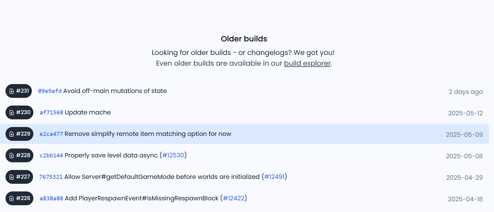
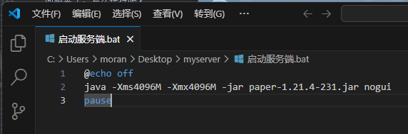

# 2.1.R-和Paper打个招呼

本教程的第一个实操教程来了！

本节课我们像模像样的把Paper运行起来试试吧！

> [!Note] 关于服务器系统
> 
> 我建议新手先用**Windows Server**，他的操作和家里的Windows电脑别无二致
> 
> 所以，以下开服脚本都使用bat脚本编写。如果你是linux系统，需要自己学习.sh脚本的编写
> 

> [!important] 更新日期
> 
> 这里以2025/05/21 17:11 PaperMC官方官网为准
> 
> Paper官网可能不会改动，但是最新的版本可能不是我现在下载的Paper 1.21.4 Build 231
> 
> 但是操作是相同的，不用担心，照着操作即可

## 在哪运行呢？

由于你还没有买服务器，所以我们就在我们自己电脑上跑一个Paper服务器吧

这个服务器暂时只有你（和你自己开的小号）能进来，反正先试试，看看Paper长什么样

看完之后，我们就会开始**从零制作一个完整的服务端**

::: details 在MC开服的语境下，服务端究竟指什么？

你在1.2.B学会了，服务端是负责处理玩家游戏内容的地方，玩家任何的操作都要问问服务端同意不同意

而1.3.D告诉你，服务端核心**只有最基本的原版游戏功能**，如果你要**拓展玩法**是不存在的

所以：在MC开服的语境下，**服务端**指基于服务端核心，搭建出来的一个**玩法完整可玩**的服务端

现在我们只是启动一个原版Paper，还没有构建玩法

:::

::: details 为什么不先买服务器？

因为你的**服务端**还没做好，在服务器上调服务端等于服务器在空跑，调试服务端完全可以在自己的电脑上进行，等做好了再买服务器也不迟

:::

## 下载Paper

最快速，直接，最新的方法就是到[PaperMC官网](https://papermc.io/)下载你想玩的MC版本的Paper

进入Paper官网后，点击**Downloads**


之后你会看到有四个核心：Paper Folia Velocity Waterfall

由于我们要下载的是Paper，所以直接点击Paper


::: details 老师，那个Waterfall和Velocity又是啥啊

em.....他们是建设**群组服**要用的[喵喵](https://www.bilibili.com/video/BV1vW411T7HM)工具

我们会在搭建群组服的时候讲到他

对了，Waterfall已经停止维护了

:::

之后你应该会看到一个巨大的按钮，让你下载用于开1.21.4版本服务器的Paper核心

这里下载的是**最新版本**，我极度推荐直接下载最新版本的Paper核心。对应的，你也需要1.21.4版本的MC才能进入服务器


::: details 可是我想开其他版本的MC服务器，怎么办呢？

Paper官网其实还是能下载旧版核心的，还是这一页，往下拉



点击[build explorer](https://papermc.io/downloads/all)那个链接，你就进入了Paper的所有构建归档


在左边选择你喜欢的MC版本，之后下载**最上面的！！！**

::: details 为什么要下载最上面的

Paper构建编号（也就是Build那一列）基本表示了Paper的构建顺序

编号越小，越早被构建，版本就越**老**。 编号越大，最晚被构建，版本就越**新**

最新的Paper版本会修复旧的漏洞，为了服务器安全，请务必下载**对应MC版本的最新构建！！！**

::: details 老师，上面的小红条和小橙条在讲什么啊

#### 小橙条

原文：Experimental builds are not ready for production servers. Proceed at your own risk!

翻译：实验性构建尚未准备好用于生产服务器。请自行承担风险！

人话：这里都还是预览版，很容易出Bug，非要用来开服，出问题我不管！

#### 小红条

原文：Legacy builds are not supported. Proceed at your own risk!

翻译：我们不再对旧版本的构建提供支持，请自行承担风险！

人话：旧的构建没人会维护了。出问题别找我！

> 旧的构建无人维护，不是这个MC版本无人维护
>
> 只是不会对旧版本的MC提供最新的Paper API支持和新特性支持
>
> 但是如果有超级重大安全漏洞，还是有人会修的
>
> 比如Paper 1.9.4就在2021-12-20进行了更新（Build #775），但是commit丢了，更新信息只有一个Update，我暂时搞不清楚发生了什么

::: details 什么是构建？

构建就是把**你不能直接用的一堆源代码**编译为**你能直接用的软件**

这是一个很笼统的说法，但是在这里够用了

:::

下载下来后，应该是这样一个东西


这个就是你的服务端核心了

::: details jar是什么？

按照**维基百科**：

在软件领域，**JAR文件**（Java归档，英语：Java ARchive）是一种软件包文件格式，通常用于聚合大量的Java类文件、相关的元数据和资源（文本、图片等）文件到一个文件，以便分发Java平台应用软件或库。

他是java程序编译后的产物，可以在安装了java的电脑上运行

我们稍后就会运行他

:::

::: details 不行，Paper官网太卡/下载太慢，怎么办？

有一些好心人搭建了镜像站，让你更方便的下载Paper等核心

比如[无极镜像站](https://www.fastmirror.net/#/home)或者[MCSL-Sync](https://sync.mcsl.com.cn/)

你也可以自行寻找

找到Paper，并下载你想要的版本的最新构建

镜像站的版本更新速度可能会比官网**慢上不少**，这只是应急手段

:::

## 运行Paper

首先，你需要**新建一个文件夹**，给他改个名字，之后把你刚下载的Paper核心放进去

> [!important] 新建文件夹的原因
> 
> 首先，服务端核心会放出大量的文件，这些文件存储了mc服务器运行需要的数据，比如**地图文件夹**
> 
> 你也不希望你的地图文件散的到处都是吧
> 
> 新建文件夹后并把核心放进去，paper创建的文件都会在这个文件夹里面，就不会乱
>

问题来了，怎么运行呢？

还记得我们在1.6.B提到的**终端**和**终端脚本**吧，服务端jar文件不能双击直接运行，我们需要一个**终端命令**来运行服务端

为了方便使用，我们把他写成.bat脚本。新建一个文本文档，并把它的文件后缀改为bat，同时为他起个名字，比如“启动服务器.bat”

右键->通过Code打开（你应该安装了VSCode，对吧）在脚本里面输入：

```bat
@echo off
java -jar <你下载的服务器核心文件名> nogui
pause
```

这是一个最简单的服务器启动脚本，保存，然后双击运行

> [!important] 不要照抄
> 
> <你下载的服务器核心文件名> 这里应该是你自己下载的服务器核心的文件名，比如`paper-1.21.4-231.jar`，不要照抄！！
> 
> 以`paper-1.21.4-231.jar`为例，应该是这样：
> 
> 
> 

双击运行之后，应该会跳出这样一个**终端窗口**，这时候Paper就开始启动了


等待Paper启动....

::: details 如果一直卡在Downloading mojang_<MC版本>.jar怎么办

你需要一些**魔法**

看得懂的话请自行行动

看不懂的话请自行寻找相关大佬私聊

把这一段话截图过去，他们会看得懂的，并且为你**传授技术**

记的夸夸大佬（

**不要把这段话发在任何论坛的问答版，真的，你实在不行你来私聊我**

~~但是最好别找我 我爱睡觉~~

::: details 大佬不愿意和我分享**Magic是什么**怎么办

还有个折中的办法

由于Paper是Spigot的下游，看过1.3.D的你应该还记得Spigot规避DMCA的方式吧

Downloading mojang_<MC版本>.jar就是在下载官方服务端

如果你死活下不下来，可以自己下载一个官方服务端塞进去

还记得我们上面提到的**服务端核心镜像站**吗？里面也能下载Vanilla核心

下载对应的mc版本的Vanilla下来，改名为Paper显示的`mojang_<MC版本>.jar`

如果你运行过一次Paper，你的文件夹应该会长这样：


把改好名的jar塞进`cache`文件夹里面，之后再次用启动脚本启动Paper

这次Paper识别到原版核心，就不会尝试下载了，会直接开始注入Paper魔法

:::

之后，服务器会突然结束运行

这时候你的服务器日志应该会和我一样
```log
Downloading mojang_1.21.4.jar
Applying patches
Starting org.bukkit.craftbukkit.Main
[17:59:23 INFO]: [bootstrap] Running Java 21 (Java HotSpot(TM) 64-Bit Server VM 21.0.3+7-LTS-152; Oracle Corporation null) on Windows 11 10.0 (amd64)
[17:59:23 INFO]: [bootstrap] Loading Paper 1.21.4-231-ver/1.21.4@09e9afd (2025-05-19T17:59:36Z) for Minecraft 1.21.4
[17:59:24 INFO]: [PluginInitializerManager] Initializing plugins...
[17:59:24 INFO]: [PluginInitializerManager] Initialized 0 plugins
[17:59:25 INFO]: [ReobfServer] Remapping server...
[17:59:30 INFO]: [ReobfServer] Done remapping server in 5127ms.
[17:59:31 WARN]: Failed to load eula.txt
[17:59:31 INFO]: You need to agree to the EULA in order to run the server. Go to eula.txt for more info.
Press any key to continue . . .
```

你可能会有点疑惑，**欸我服务器呢？怎么停了？？**

请注意日志第**10,11行**

```log:line-numbers=10
[17:59:31 WARN]: Failed to load eula.txt
[17:59:31 INFO]: You need to agree to the EULA in order to run the server. Go to eula.txt for more info.
Press any key to continue . . .
```

翻译过来就是：


```log:line-numbers=10
[17:59:31 WARN]: 加载eula.txt失败
[17:59:31 INFO]: 运行服务器前，你需要先同意EULA协议. 要获取更多信息，请查看eula.txt.
Press any key to continue . . .
```

那么我们打开`eula.txt`看一看，他在这里：


```txt
#By changing the setting below to TRUE you are indicating your agreement to our EULA (https://aka.ms/MinecraftEULA).
#翻译：如果你同意EULA协议，就把下面的选项设为true
#Wed May 21 17:59:31 CST 2025
eula=false
```

EULA是**Minecraft 最终用户许可协议**，它规定了开服务器的时候，你可以做什么，不可以做什么。如果你把`eula=false`改为`eula=true`，则视为
你同意了EULA，你的服务器讲遵循EULA运行。否则，mc服务器将**拒绝启动**

我们需要把EULA设为true才能开服，所以，我们修改`eula.txt`

```txt
#By changing the setting below to TRUE you are indicating your agreement to our EULA (https://aka.ms/MinecraftEULA).
#Wed May 21 17:59:31 CST 2025
eula=true
```

之后再次启动服务端

这时候paper应该就会开始按部就班的启动了....

::: details EULA 与你，和你的服务器

我觉得我的表述能力欠佳，所以直接引用[极光Creeper的开服教程](https://www.mcbbs.co/thread-255-1-1.html)里面极光大佬的原话：

> 但是 所有教程都只告诉你把eula改成true 但是有多少人能告诉你eula是什么呢？
>
> EULA : 最终用户许可协议 其定义可以在百度百科找到 [百度百科](https://baike.baidu.com/item/%E6%9C%80%E7%BB%88%E7%94%A8%E6%88%B7%E8%AE%B8%E5%8F%AF%E5%8D%8F%E8%AE%AE/7228616?fr=aladdin&fromid=10688321&fromtitle=EULA)
>
> Minecraft EULA : [官方汉化链接](https://www.minecraft.net/zh-hans/eula) 请点进去看清楚了
>
> 以下两条较重要 我更换了主语便于大家理解
>
> 不得将Mojang创建的任何内容用于商业用途   不得试图通过Mojang创建的任何内容赚钱
>
>      这意味着你几乎和开公益服没区别 但我们关起门来说话 违反eula的服务器与服主 全世界比比皆是
>
>      这不代表你可以认为 你可以正大光明地开商业化服务器
>
>      但在这种大环境下 我相信可怜的绝大部分人 做不到 不违反eula
>
>      所以 请你们抱着内疚、悔恨的心理 看待你开了违反eula的服务器这一事实
>
>      如果可以 请开公益服 或转为公益服

如果可以，请开公益服，或转为公益服

moran0710在此向所有公益服服主致敬

:::

在一大串似懂非懂的日志里面，你看到了一条日志：

```log
[18:41:44 INFO]: Done (16.089s)! For help, type "help"
```

看到这条日志，那么恭喜你，你的服务器已经启动完成了！！

**如果你是正版玩家**，你可以立刻进入服务器

**如果你是离线玩家**，那你可能要先读完2.2.C才能进入服务器

## 进入服务器

如果不经过任何设置，你可以用这种方法进入服务器：

1. 启动对应版本的MC
2. 在多人游戏->添加服务器->服务器ip内输入`localhost:25565`
3. 之后你就能看到：


我们成功识别到我们新开的服务器了！现在进入游戏玩玩吧

::: details localhost:25565是什么

`localhost`代表你自己的的电脑的**IP地址**

冒号后面的`25565`则是**端口号**

mc服务器默认开放在25565端口

如果你不知道IP地址和端口是什么，请参阅

[一万小时计划06，什么是IP地址](https://www.bilibili.com/video/BV1ua411B7Km)

[一万小时计划07，什么是端口](https://www.bilibili.com/video/BV1Gq4y117wk)

:::

## 课后作业

尝试读读Paper文档。读不懂没关系，接下来我会把这些内容手把手教你

## 课后休息

墨冉在编辑本节的时候，突然发现Paper日志多了三行：
```log
[18:41:44 INFO]: *************************************************************************************
[18:41:44 INFO]: This is the first time you're starting this server.
[18:41:44 INFO]: It's recommended you read our 'Getting Started' documentation for guidance.
[18:41:44 INFO]: View this and more helpful information here: https://docs.papermc.io/paper/next-steps
[18:41:44 INFO]: *************************************************************************************
```

这三行日志的意思是：

```log
[18:41:44 INFO]: *************************************************************************************
[18:41:44 INFO]: 这看起来是你第一次启动这个服务器
[18:41:44 INFO]: 建议新手阅读我们的“入门”文档以获取帮助
[18:41:44 INFO]: 你可以在这里找到更多有帮助的信息: https://docs.papermc.io/paper/next-steps
[18:41:44 INFO]: *************************************************************************************
```

*这三行日志在[Commit 046fc51](https://github.com/PaperMC/Paper/commit/046fc5171f3d933200cdf010c4db12d4b5b8517b#diff-5d5656a170861ad4828488854cc0352f36386686819a4d5e3370124aa0488c57R572-R871)中加入，这也许就是Paper对新手的关心吧.jpg*

*感谢红石中继站群友@阳帆→冰块帮忙查证*

*但是Paper文档这玩意是英文的，那很糟了*

统计字数：3055