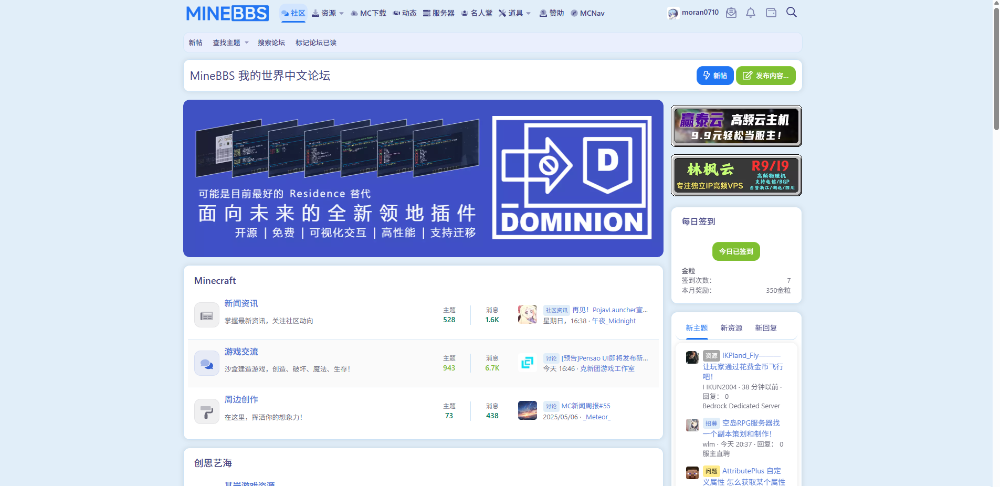
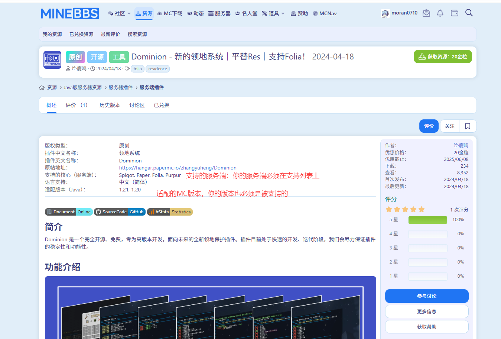
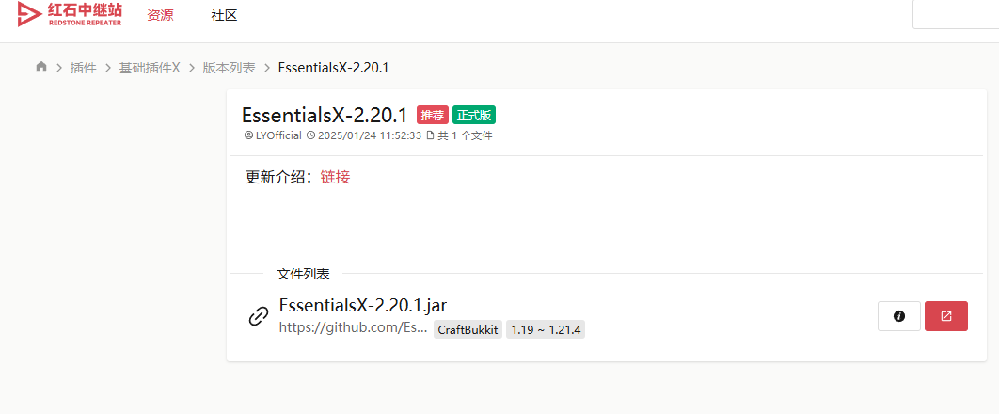
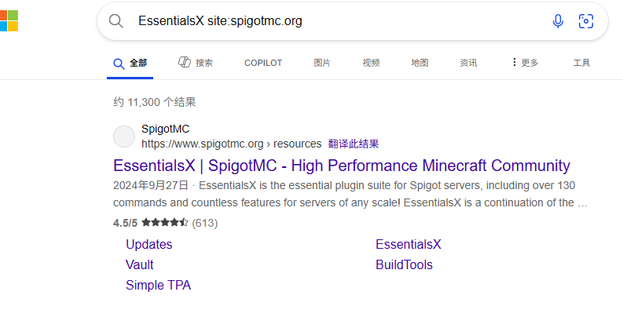
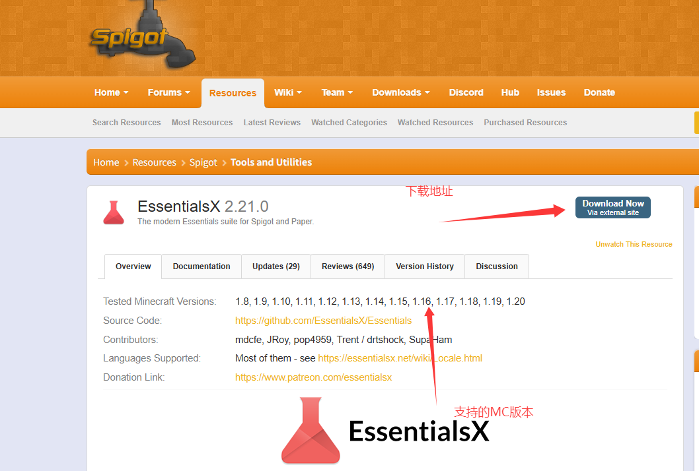
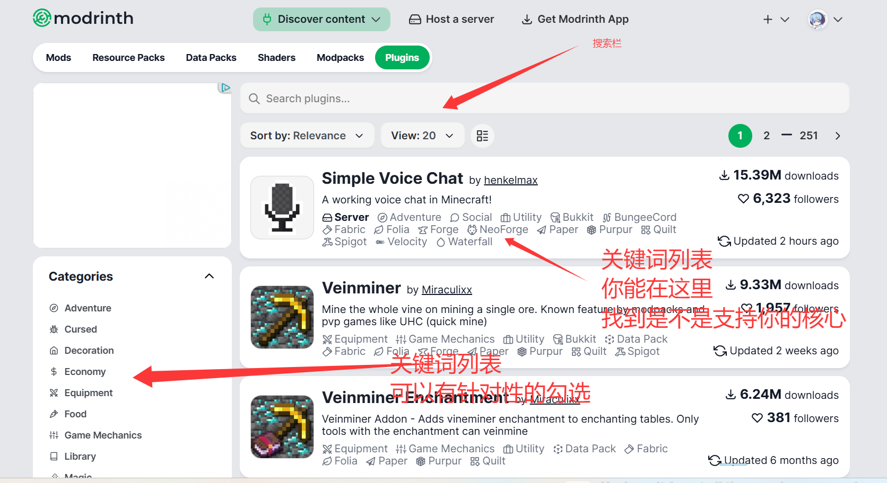
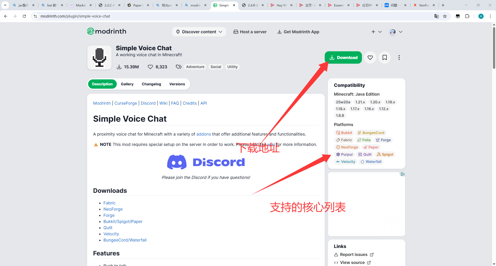
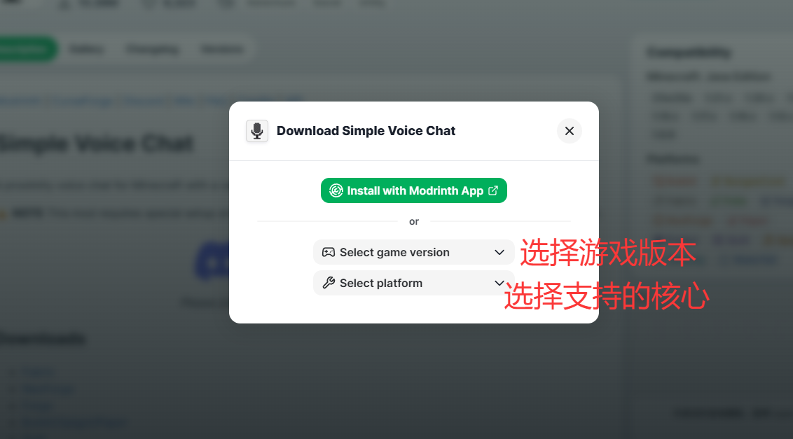

# 2.4.R-插件？启动！

现在，我们要真正的安装一些插件，为原版的服务器注入一些魔法了

但是我们还是要先知道插件到底是什么

## 什么是插件？

插件是一个.jar文件，用于拓展玩法

你需要把插件丢进plugins文件夹下

## 插件不能做什么？

由于插件**无法**修改玩家的游戏，所以**他不能凭空造出一个新物品**

插件一切的玩法拓展，都是以**原版的行为**修改的

::: details 但是有些插件能加入工业等新功能，甚至有新物品，是怎么一回事呢？

插件可以靠**NBT**等方法标注一个原版的物品，如果检测到这是特殊物品，则执行特殊行为（其实也是基于原版来修改）

这种操作的典型就是**粘液科技**

但是有些插件会添加新的物品是怎么一回事呢？因为客户端能识别到这些**特殊标记**，但是没有对应的贴图

这时候，服务器一般会要求你安装一个**材质包**，这时候游戏就能通过这个材质包给这个物品上贴图了

这类型的插件有很多，比如ItemAdder（IA）

:::

那么，知道了插件是什么，能做什么之后，我们该如何找插件呢？

## 如何寻找插件

现在MC论坛有很多，你需要去各种论坛的**多人游戏->Java版服务器**或者类似的板块寻找

我们举两个例子

::: details 在MineBBS和类似框架的论坛（比如HiMCBBS）寻找插件

MineBBS使用**XenForo**作为论坛框架，这类论坛差不多长这样

如果看到长这样的论坛，那么就可以按照**这个方法**下载插件：

1. 找到Java插件板块（以MineBBS为例：在 **Java版多人游戏->服务端插件** 板块内）
2. 你可以逛一逛，或者直接搜索你想要的功能，如“领地”

如何判断这个插件能不能安装在自己的服务器上

这是一个插件的介绍页，这里有几个内容你务必要关心

1. **支持的核心**，如果你的核心不在支持列表里面，很可能用不了。这里看到Dominion支持Paper，所以我们可以用这个插件
2. **支持的游戏版本**，这也是很重要的一项，游戏版本必须匹配

如果找到喜欢的插件，记得**Ctrl+F**收藏这个帖子，以便日后找不到

之后就可以支付金粒购买了~~

:::

::: details 在红石中继站寻找插件

**红石中继站**的资源板块我觉得是国内做的最好的，用起来也最简单。但是由于是新生站点，资源比较少

1. 打开[红石中继站-资源版](https://www.mczwlt.net/resource?type=plugin)，选择插件，之后开搜
2. 选择并点击下载后，你应该能看到支持的核心版本，就像这样

这里声明了支持CraftBukkit核心，所以Spigot和Paper和Paper分叉都能使用

如果找到喜欢的插件，记得Ctrl+F收藏这个帖子，以便日后找不到

:::

:::details 使用SpigotMC

SpigotMC是国外最大的插件论坛

> [!important] SpigotMC是国外论坛！
> 
> 需要你有 **英语基础**

1. 不推荐用SpigotMC那个难用至极的搜索引擎，你可以用Bing搜索，但是搜索的时候关键词这样打

**<英文关键词> site:spigotmc.org**

这样的搜索用起来甚至比SpigotMC的那个搜索引擎好用....

之后点进你的搜索结果

SpigotMC的资源肯定支持Spigot核心，同样的，也肯定支持Paper和Paper分叉

:::

:::details 使用Modrinth

Modrinth是一个新生的MC资源站

> [!important] Modrinth是国外论坛！
>
> 需要你有 **英语基础**
> 

1. 进入[Modrinth](https://modrinth.com/)，点击`Discover mods`，之后选择`Plugins`

点击下载后

:::

::: details 关于前置插件

一些插件可能需要某些前置插件才能使用，也就是说，你要同时安装**本插件**和**他的前置插件**

一般插件资源介绍页面里面都会说明

:::

## 如何安装插件

丢进plugins文件夹，之后**重启服务端**

## 那么我需要什么插件呢？

嘛....很推荐各位自己去找插件，但是我这里可以给大家一些思路

这里提到的一些插件是必备插件，并且会给出我的推荐

我们后面会选择一些插件进行**配置教学**

### 基础插件

**基础插件**提供了一整套服务器会用到的小功能，比如：

EssentialsX：提供/tpa /home 木牌指令....等超级多的基础功能，这些都是零碎的小功能

CMI：一个付费的基础插件，比EssentialsX强，但是配置文件长的离谱，新手看了一定会被吓跑

:::details 为什么会有人不推荐用基础插件

但是我们是新手，使用基础插件能简化部分配置，让你快速入门，所以我认为基础插件还算有必要

引用[笨蛋文档 | 删掉基础插件](https://nitwikit.8aka.org/Java/process/plugin/ManageTool/BasicPlugins/delete/)的说法

> CMI 在拼命的加新功能，多而不精，插件变得臃肿不堪小白比较难上手
> 
> EssentialsX 却在拼命追求稳定性，一点新功能不加的，现在随便个 tpa 插件都有点击聊天框信息同意传送的功能，他却没有，你还不能自己写 json 补
>
> 也许，是时候删除这俩玩意了
>
> 实际上，经济功能装个 XConomy 足够了
>
> 而对于 tpa，warp，home，back 等传送功能，或许你可以试试 HuskHomes
>
> CMI 的那些功能几乎都有可以平替的插件

:::

### 